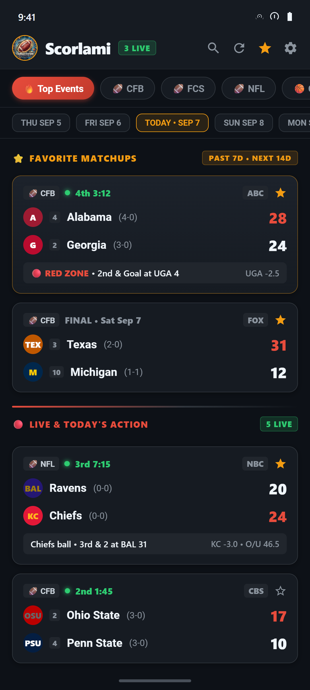
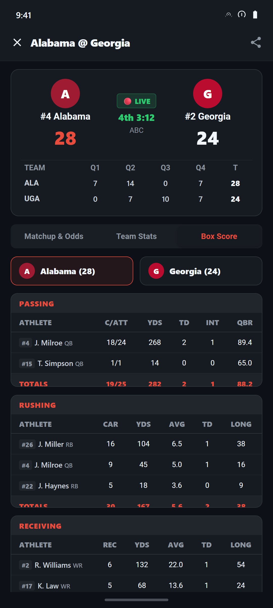
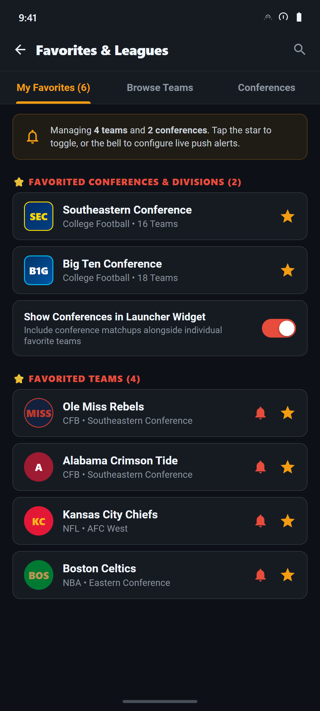
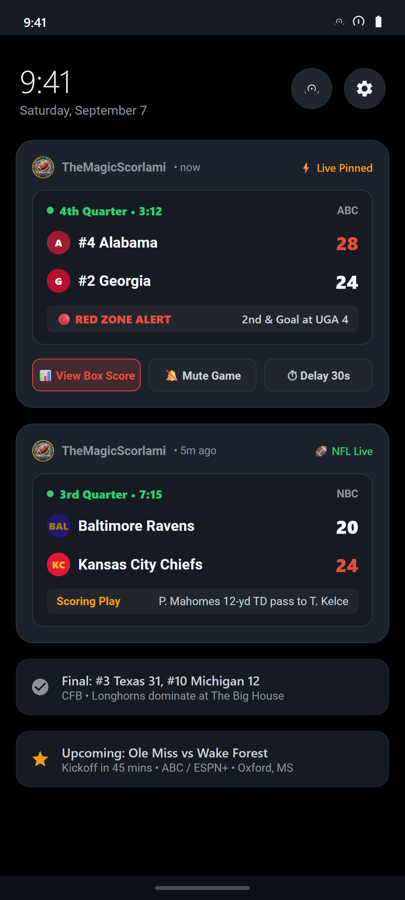

# 🏈 TheMagicScorlami

[-3DDC84?logo=android&logoColor=white)](https://android.com)
[](https://github.com/cavant/TheMagicScorlami/releases)
[-success?logo=android&logoColor=white)](releases/TheMagicScorlami-v1.4.5-release.apk)
[](https://kotlinlang.org)
[](https://developer.android.com/jetpack/compose)
[](https://developer.android.com/jetpack/compose/glance)
[](LICENSE)
[](#-privacy--zero-data-policy)
[](https://buymeacoffee.com/themagicsalami)

**TheMagicScorlami** is an ultra-fast, lightweight, ad-free sports tracking and live alert app built natively with **Jetpack Compose**, **Glance AppWidgets**, and **Material 3**. Designed from the ground up for sports enthusiasts who demand real-time event updates, instant live notifications, and deep game stats without the clutter, advertisements, or heavy tracking of commercial apps.

---

## 📦 Direct Download

| Artifact | Version | Direct Download Link | Checksum (SHA-256) |
| :--- | :--- | :--- | :--- |
| **Signed Release APK** | `v1.4.5` (Build 9) | [**Download TheMagicScorlami-v1.4.5-release.apk**](releases/TheMagicScorlami-v1.4.5-release.apk) | `BE01A53F...BC998DD` |

*For all historical and latest releases, visit the [GitHub Releases Page](https://github.com/cavant/TheMagicScorlami/releases).*

---

## 📸 App Showcase

| 🔥 Top Events Feed | 📊 Excel Box Scores | ⭐ Favorites & Conferences | 🔔 Live Scoreboard Shade |
| :---: | :---: | :---: | :---: |
| <a href="screenshots/home_scores_live.png"></a> | <a href="screenshots/box_score_grid.png"></a> | <a href="screenshots/favorites_manager.png"></a> | <a href="screenshots/pinned_notifications.png"></a> |
| **Top Events Hero Deck**<br>Past 7d finals & next 14d lookahead | **ESPN-Style Grid**<br>Sticky athlete column & bold totals | **Conferences & Teams**<br>SEC/Big Ten & widget toggle | **Notification Shade**<br>Real-time red zone & score alerts |

---

## 🌟 Key Features

### 🔥 Top Events Hero Feed (-7 Days to +14 Days)
- **3-Week Intelligent Window**: Automatically looks back 7 days for recent final scores and looks ahead 14 days for upcoming matchups for your favorite teams and conferences.
- **Hero Card Deck**: Surfaces your favorited team and conference games right at the top of your feed.
- **Sport Priority Sorting**: Daily live action places Football (`CFB`, `NFL`) and Basketball (`CBB`, `WCBB`, `NBA`, `WNBA`) front and center, followed by remaining 1-A and pro sports.
- **Visual Page Break**: Crisp `⚡ LIVE & TODAY'S ACTION` divider separates your curated favorites from the full daily slate.

### ⭐ Conference & Division Favoriting
- **1-A College Conferences**: One-tap favoriting for major FBS conferences (SEC, Big Ten, Big 12, ACC, Big East, Mountain West, AAC, Sun Belt, MAC, C-USA).
- **Pro Divisions**: Track entire NFL, NBA, MLB, and NHL divisions.
- **Dedicated Conferences Tab**: Search, filter by league, and manage starred conferences in a single unified hub.
- **Independent Widget Toggle**: Choose whether conference matches appear in your launcher widget or stay restricted to your starred individual teams.
- **Spam Protection**: Notification triggers remain strictly isolated to individual favorite teams, preventing 16-team conference alert flooding.

### 📊 ESPN-Style Excel Grid Box Scores
- **Interactive Team Tabs**: Away vs Home team switcher cards with team logos, records, and current scores.
- **Sticky First Column**: Athlete name, jersey number badge (e.g., `#4`), and position stay pinned on the left during horizontal scrolling.
- **Uniform 54dp Columns**: All stat columns (Passing, Rushing, Receiving, Defense, Kicking, Punting) maintain consistent Excel-table alignment.
- **Category Totals Row**: Every stat group concludes with a bold, distinct `TOTALS` summary row.
- **In-Depth Game Situations**: Real-time down, distance, yardline, possession, red zone alerts, baseball bases/counts, hockey shots on goal, and power play states.

### 🏈 17 Sports & Leagues (Including FCS, D-II, & D-III)
- **College Football**: FBS, FCS, Division II, Division III. *(Lower divisions isolated to dedicated tabs to keep main boards clean)*.
- **Pro Football**: NFL.
- **College Basketball**: Men's Division I (CBB) & Women's Division I (WCBB).
- **Pro Basketball**: NBA & WNBA.
- **Baseball**: MLB & College Baseball.
- **Hockey**: NHL.
- **Soccer**: MLS, English Premier League (EPL), UEFA Champions League (UCL), Spanish La Liga.
- **Combat & Racing**: UFC (MMA) and Formula 1 (F1).

### 🔔 Smart Notification System & Live Scoreboard
- **Pinned Live Scoreboard**: High-priority status bar persistent notification that updates in real time as the game unfolds.
- **Granular Alert Triggers**: Toggle alerts specifically for Game Kickoff/Start, Scoring Plays, Lead Changes, Halftime, Final Score, and Red Zone drives.
- **Anti-Spoiler Buffer**: Delay alerts from 0 to 120 seconds to perfectly sync with cable or streaming broadcast latency.

### 🎨 8 Tailored Themes & Stadium Data Saver
- **Theme Modes**: Sportslami Gold, Morphe Dark, AMOLED Pitch Black, Forest Green, Crimson Gridiron, Deep Navy, Royal Court, and Android 12+ Dynamic Material You.
- **Stadium Data Saver**: One-tap toggle in settings that replaces remote network logos with local high-contrast text badges to minimize bandwidth in congested stadium environments.

---

## 🛠️ Architecture & Tech Stack

TheMagicScorlami follows modern Android architecture best practices with **Unidirectional Data Flow (MVI)** and decoupled presentation/domain layers:

```
┌────────────────────────────────────────────────────────┐
│                   Jetpack Compose UI                   │
│   (HomeScreen, DetailSheet, Favorites, Settings, Theme)│
└───────────┬────────────────────────────────▲───────────┘
            │ User Actions                   │ StateFlow
┌───────────▼────────────────────────────────┴───────────┐
│                 MultiSportRepository                   │
│       (Top Events Engine, Caching, Sport Schedulers)   │
└───────────┬────────────────────────────────▲───────────┘
            │ Remote Calls                   │ Local Preferences
┌───────────▼──────────────┐       ┌─────────┴───────────┐
│   MultiSportHttpClient   │       │ SportslamiPreferences│
│   (OkHttp + Cache-Control)       │ (AndroidX DataStore) │
└───────────┬──────────────┘       └─────────────────────┘
            │ Raw JSON
┌───────────▼──────────────┐
│    MultiSportParser      │
│  (ESPN Scoreboard/Summary)
└──────────────────────────┘
```

- **Language**: Kotlin 2.0+
- **UI Framework**: Jetpack Compose with Material 3
- **Widgets**: Jetpack Glance (`androidx.glance:glance-appwidget:1.1.1`)
- **Persistence**: Jetpack DataStore Preferences (`androidx.datastore:datastore-preferences`)
- **Background Work**: AndroidX WorkManager (`androidx.work:work-runtime-ktx`)
- **Networking**: OkHttp 4 with disk response caching
- **Image Loading**: Coil Compose 2.6 with SVG support

---

## 🏗️ Getting Started & Building

### Prerequisites
- **Android Studio**: Ladybug / Meerkat (2024.2+) or newer
- **JDK**: Java 17 or higher
- **Android SDK**: Compile SDK 35, Min SDK 24

### Build Commands
Clone the repository:
```bash
git clone https://github.com/cavant/TheMagicScorlami.git
cd TheMagicScorlami
```

Build the debug APK:
```bash
./gradlew assembleDebug
```

Run automated unit tests:
```bash
./gradlew testDebugUnitTest
```

Build and place production release APK into `releases/`:
```bash
./gradlew buildReleaseApk
```

Artifact outputs are automatically signed and placed in:
- `releases/TheMagicScorlami-v1.4.5-release.apk`
- `releases/TheMagicScorlami-latest.apk`
*(Also mirrored in `app/build/outputs/apk/release/app-release.apk`)*

---

## 🔒 Privacy & Zero-Data Policy

TheMagicScorlami respects user privacy completely:
- **Zero Data Collection**: We do not collect, transmit, or store any personal information, email addresses, IP addresses, or device identifiers.
- **Zero Third-Party Trackers**: No advertising SDKs, no behavioral trackers, and no telemetry services.
- **100% Local Storage**: All favorites, notification preferences, and settings are saved strictly on your device using Android Jetpack DataStore.

---

## ⚖️ Legal Disclaimers & Fair Use

- **Nominative Fair Use**: All product names, logos, brands, and registered trademarks displayed in this application (including NCAA, NFL, NBA, MLB, NHL, MLS, and ESPN) are the property of their respective owners. Their use is strictly for descriptive identification purposes under nominative fair use (15 U.S.C. § 1125(c)(3)(A)).
- **Factual Event Reporting**: All sports scores, game times, rankings, and in-game statistics are non-copyrightable factual matters of public knowledge reported in real time (*NBA v. Motorola, Inc.*, 105 F.3d 841 (2d Cir. 1997)).
- **Independent Project**: TheMagicScorlami is an independent fan-made project and is not affiliated with, sponsored by, or endorsed by the NCAA, NFL, NBA, MLB, NHL, or ESPN.

---

## ☕ Support the Project

TheMagicScorlami is built for sports fans with zero ads and zero paywalls. If you enjoy the app, consider supporting ongoing development:

[](https://buymeacoffee.com/themagicsalami)
